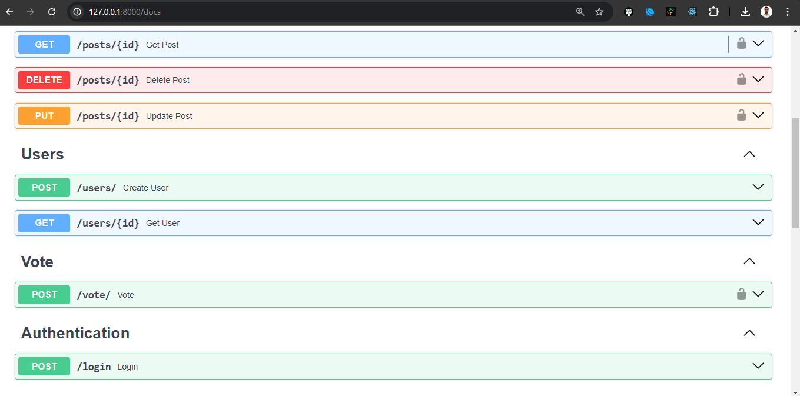
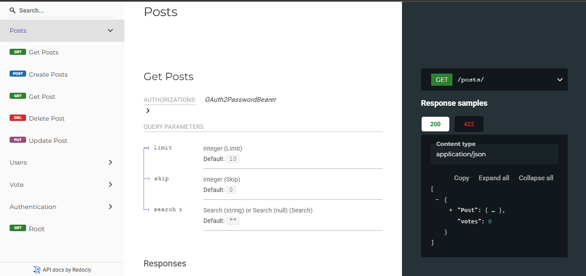

# FastAPI Social App

This project is a social media application built using FastAPI, PostgreSQL, and Docker. It includes features such as user authentication, post creation, voting on posts, and more.

## Table of Contents

- [FastAPI Social App](#fastapi-social-app)
  - [Table of Contents](#table-of-contents)
  - [Installation](#installation)
  - [Running the Application](#running-the-application)
    - [Using Docker](#using-docker)
    - [Without Docker](#without-docker)
  - [API Endpoints](#api-endpoints)
    - [Authentication](#authentication)
    - [Users](#users)
    - [Posts](#posts)
    - [Votes](#votes)
  - [Environment Variables](#environment-variables)
  - [Database Migrations](#database-migrations)
  - [Project Structure](#project-structure)
- [Snapshot](#snapshot)
  - [Swagger UI Docs](#swagger-ui-docs)
  - [ReDocs](#redocs)
  - [Contributing](#contributing)
  - [License](#license)

## Installation

1. **Clone the repository:**

   ```bash
   git clone https://github.com/yourusername/fastapi-social-app.git
   cd fastapi-social-app
   ```

2. **Create and activate a virtual environment:**

   ```bash
   python -m venv .venv
   source .venv/bin/activate  # On Windows use `.venv\Scripts\activate`
   ```

3. **Install the dependencies:**

   ```bash
   pip install -r requirements.txt
   ```

4. **Set up the environment variables:**

   Create a `.env` file in the root directory and add the following variables:

   ```properties
   HOST='localhost'
   DATABASE='social_app'
   USER='postgres'
   PASSWORD='root'
   SECRET_KEY='your_secret_key'
   ALGORITHM='HS256'
   ACCESS_TOKEN_EXPIRE_MINUTES=60
   ```

## Running the Application

### Using Docker

1. **Build and run the Docker containers:**

   ```bash
   docker compose -f docker-compose-dev.yml up --build
   ```

2. **Access the application:**

   The application will be running at `http://localhost:8000`.

### Without Docker

1. **Run the FastAPI application:**

   ```bash
   uvicorn app.main:app --reload
   ```

2. **Access the application:**

   The application will be running at `http://localhost:8000`.

## API Endpoints

### Authentication

- **POST /login/**: User login.

### Users

- **POST /users/**: Create a new user.
- **GET /users/{id}**: Get user details by ID.

### Posts

- **GET /posts/**: Get all posts.
- **GET /posts/{id}**: Get a post by ID.
- **POST /posts/**: Create a new post.
- **PUT /posts/{id}**: Update a post by ID.
- **DELETE /posts/{id}**: Delete a post by ID.

### Votes

- **POST /vote/**: Vote on a post.

## Environment Variables

The application uses the following environment variables:

- `HOST`: Database host.
- `DATABASE`: Database name.
- `USER`: Database user.
- `PASSWORD`: Database password.
- `SECRET_KEY`: Secret key for JWT.
- `ALGORITHM`: Algorithm for JWT.
- `ACCESS_TOKEN_EXPIRE_MINUTES`: Access token expiration time in minutes.

## Database Migrations

The project uses Alembic for database migrations.

1. **Generate a new migration:**

   ```bash
   alembic revision --autogenerate -m "Migration message"
   ```

2. **Apply the migrations:**

   ```bash
   alembic upgrade head
   ```

## Project Structure

```
fastapi-social-app/
├── alembic/
│   ├── versions/
│   ├── env.py
│   └── README
├── app/
│   ├── __init__.py
│   ├── main.py
│   ├── models.py
│   ├── schemas.py
│   ├── database.py
│   ├── oauth2.py
│   ├── utils.py
│   └── routers/
│       ├── __init__.py
│       ├── post.py
│       ├── user.py
│       ├── auth.py
│       └── vote.py
├── .env
├── .gitignore
├── Dockerfile
├── docker-compose-dev.yml
├── docker-compose-prod.yml
├── requirements.txt
└── README.md
```

# Snapshot
## Swagger UI Docs

- You can check in the http://localhost:8000/docs


## ReDocs
- You can check in the http://localhost:8000/redoc


## Contributing

Contributions are welcome! Please open an issue or submit a pull request for any changes.

## License

This project is licensed under the MIT License.
